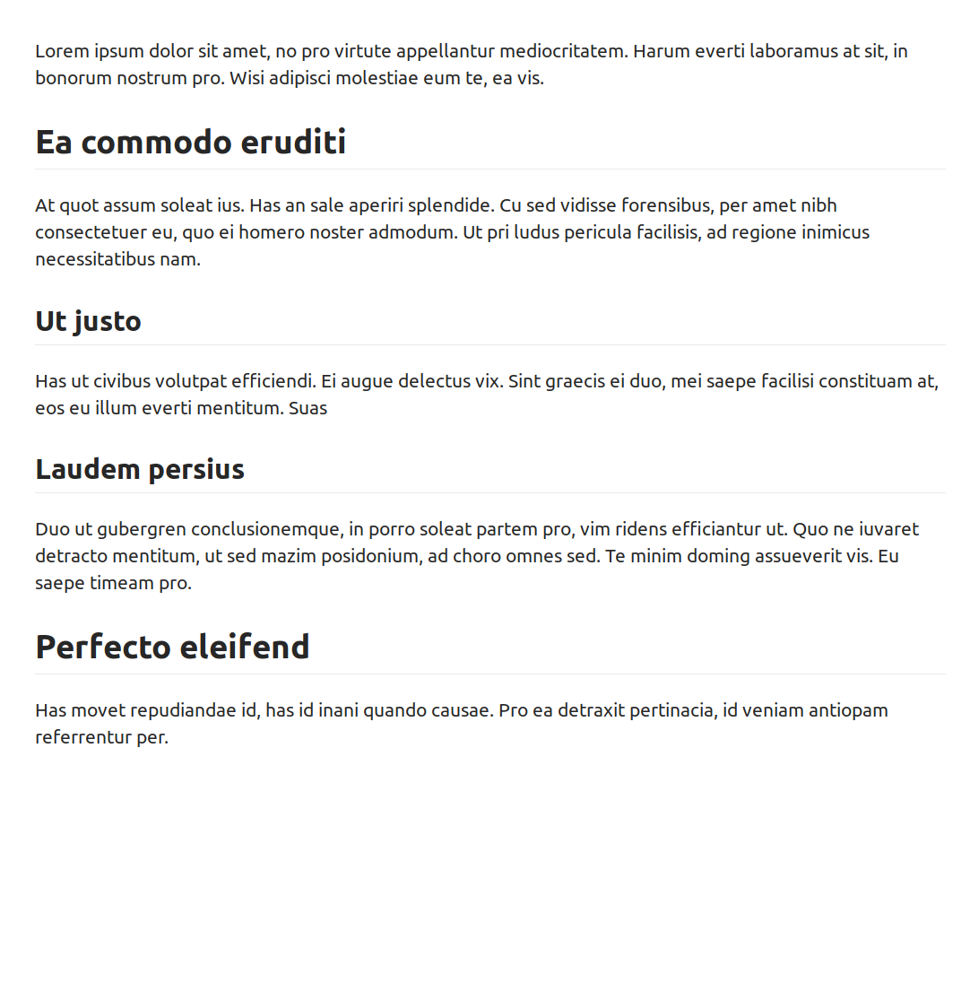
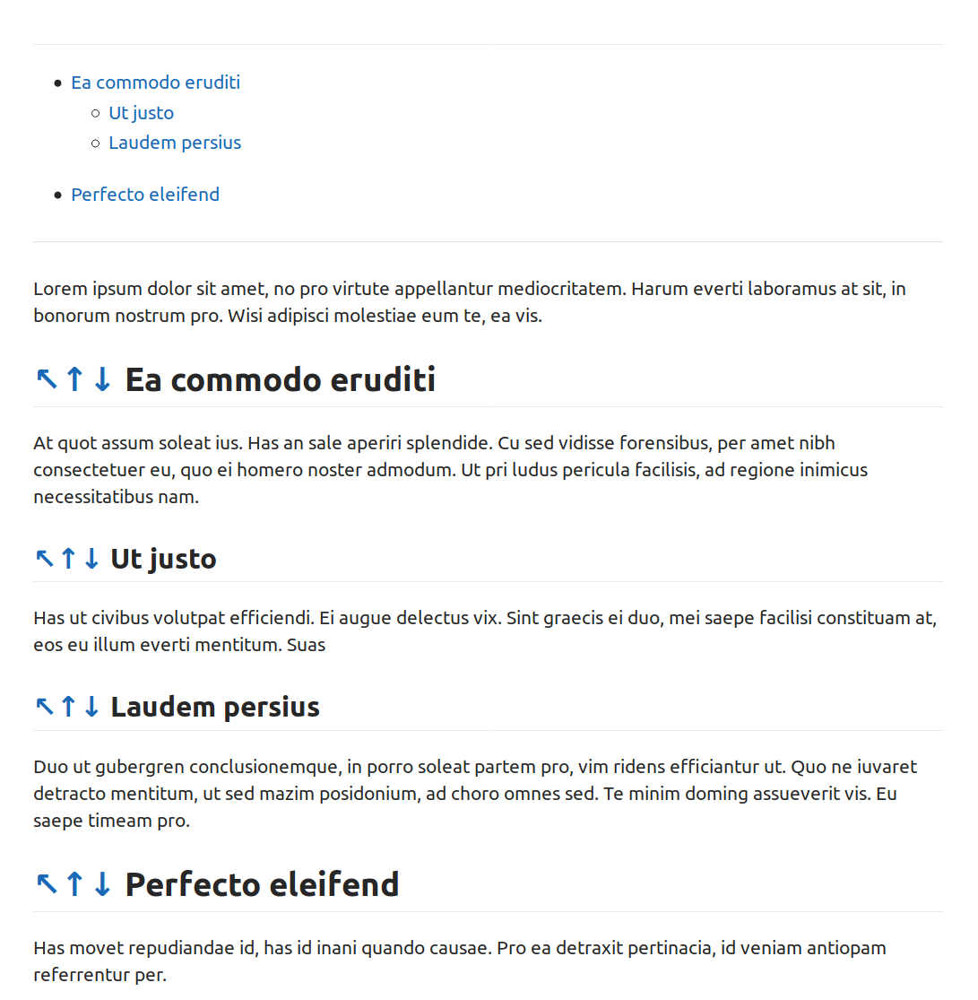

[](https://github.com/jangroth/markdownhelper/actions)

# CLI Helper for Markdown

Adds or removes table of contents to  markdown document. 

```bash
./bin/mdh --help
Usage: mdh_cli.py [OPTIONS] COMMAND [ARGS]...

Options:
  --help  Show this message and exit.

Commands:
  cleanse  Removes existing TOC and all internal links
  dump     Dumps markdown document to console
  toc      Adds TOC to top of file
```

## Usage

Add new TOC. This will also remove the old TOC, if it was rendered with `mdh`.

```bash
./bin/mdh toc tests/resources/simple.md 
```

Optionally, add navigation arrows to headers:

```bash
./bin/mdh toc --navigation tests/resources/simple.md 
```

Optionally, only render up to _top level_:

```bash
./bin/mdh toc --top-level 2 tests/resources/simple.md 
```

If necessary, remove old TOC:

```bash
./bin/mdh cleanse tests/resources/simple.md 
```

Dump existing document:

```bash
./bin/mdh dump tests/resources/simple.md 
```

## Screenshots

### Before


### After
